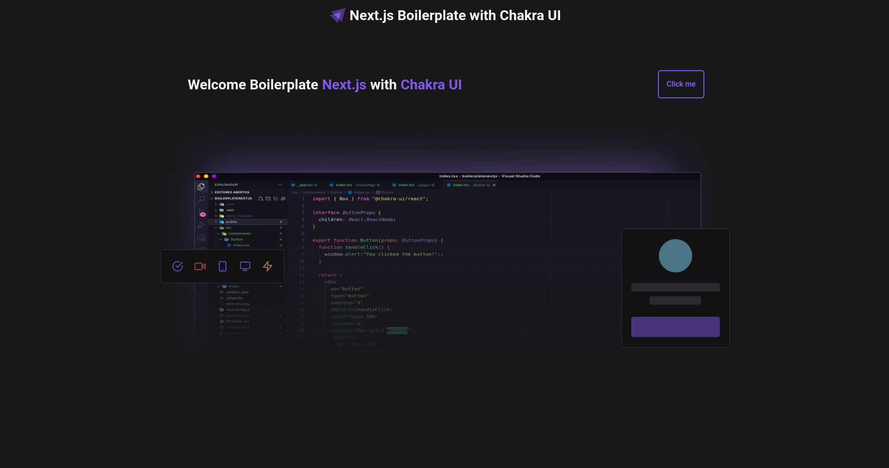

<h1 align="center">
🚧 Boilerplate NextJS  🚧
</h1>

<p align="center">

  

  

  <a href="https://www.palamarsolutionit.com.br/">
      
  </a>

  <a href="https://github.com/Palamar-Dev/Boilerplate-NextJS/commits/master">
      
  </a>

  
</p>

<p align="center">

  <a target="_blank" href="https://reactjs.org/">
    
  </a>

  <a target="_blank" href="https://nextjs.org/">
      
  </a>
</p>

<h2 align="center">
  Welcome Boilerplate Next.js with Chakra UI
</h2>

## 🚀 Sobre o Projeto

Este e um boilerplate em [Next.js](https://nextjs.org/) usado em meus projetos FrontEnd.

## 🎨 Layout

<!-- Design feito por -->
<table>  
  <tr>
    <td>
      <a target="_blank">
        
      </a>
    </td>    
  </tr>
</table>

## 🔨 Tecnologias:

- **[TypeScript](https://www.typescriptlang.org/)**
- **[NextJS](https://nextjs.org/)**
- **[ChakraUI](https://chakra-ui.com/getting-started)**
- **[Jest](https://jestjs.io/)**
- **[Eslint](https://eslint.org/)**
- **[Prettier](https://prettier.io/)**

## 🔎 Comandos

- `dev`: Executa a aplicação em `localhost:3000`
- `build`: Cria a Build do projeto
- `start`: Inicia um servidor simples com o código de produção
- `lint`: Executa o **Linter** em todos os componentes e páginas

## 🚀 Como rodar este projeto

Para clonar e executar este aplicativo, você precisará de [Git](https://git-scm.com) e [NodeJs](https://nodejs.org/en/) Instalado em seu computador.

### 🌀 Clonando o repositório

```bash
# Clone este repositório
$ git clone git@github.com:Palamar-Dev/Boilerplate-NextJS.git

# Acesse a pasta do projeto no terminal/cmd
$ cd Boilerplate-NextJS
```

### 🎲 Rodando a Aplicação

```bash
# Instale as dependências
$ yarn install

# Execute a Aplicação em Desenvolvimento
$ yarn dev

# O servidor inciará na porta:3000 - acesse http://localhost:3000

```

### 💾 Comandos Úteis

```bash
#Criação de um componente completo com (index.tsx / stories.tsx / styles.ts / test.tsx)
$ yarn generate ComponentName

```

## 🤔 Como contribuir para o projeto

- Faça um **fork** do projeto;
- Crie uma nova branch com as suas alterações: `git checkout -b my-feature`
- Salve as alterações e crie uma mensagem de commit contando o que você fez:`git commit -m "feature: My new feature"`
- Envie as suas alterações: `git push origin my-feature`

## 📝 Licença

Este projeto esta sobe a licença MIT. Veja a [LICENÇA](https://opensource.org/licenses/MIT) para saber mais.

Feito com ❤️ por Aleksander Palamar 👋🏽 [Entre em contato!](https://www.palamarsolutionit.com.br/)

</h3>
